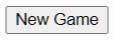

# Part 2 - Interaction (Input)

HTML is fairly simple to learn and only takes a bit of practice to get items on the screen. At this point we've seen pictures, tables, lists, paragraphs, divs, and even buttons! But it is all _static_ (which means stays in place - not interactive). **How can we make our website react to user input?**

### Add a button:
One of the easier ways of understanding interactions is with the use of a `<button>`. Let's add a "New Game" button to our screen:

Can you remember how to do that?

### Setup JavaScript:
We have no JavaScript file in this project! Oops!

In order to make this button interactive, we need to do a couple things.

1. Add a new file to your project called `script.js`.
2. _Load_ the JavaScript file by adding the following line to the `<head>` section of your [index.html](#index.html) file:
```HTML
<script src="script.js" defer></script>
```
3. Inside your new [script.js](#script.js) file, add the "use strict" directive:
```JS
'use strict';
```

Now we're ready to use some JavaScript to control the button!

### Give the button an identification:
The button you added in HTML is just a boring, generic button. It has no _identity_ - it's lost in this world. There is no way for us to interact with it using JavaScript. **It needs an _id_**.

Inside the `<button>` tag, add the `id` option with a meaningful name:
```HTML
<button id="new_game_btn"> ...
```
Notice the format of that example and the quotation marks.

### Add an EVENT LISTENER:
When a user interacts with a program, the interactions create _[events](https://www.w3schools.com/jsref/dom_obj_event.asp)_. This could be a click, a keypress, a mouse movement, etc... There are many different types of [events](https://www.w3schools.com/jsref/dom_obj_event.asp) in a computer program. We are going to listen for a "click" event on the button.

Inside the [script.js](#script.js) file, we are going to add a "listener" on the button to specifically listen for the **"click"** event. When that event happens, we will call the `new_game` function (that we haven't written yet).

It works like this:
- Get the HTML `document`
- Ask it for the button element
- Add the listener to that button
  ```JS
  document.getElementById("new_game_btn").addEventListener("click", new_game);
  ```

Now the button will call `new_game()` whenever it is clicked.

### Code the `new_game()` function:
Now we will add the `new_game()` function in our JavaScript file so that the button actually does something. Let's confirm with the user that they want a new game, and if they do we will as for their name.
```JS
let p1_name = "";
let p2_name = "";

function new_game() {
  let answer = confirm("Are you sure you want a new game?");

  // The confirm dialog returns `true` or `false`
  if (answer) {
    p1_name = prompt("Player 1 (X) - What is your name?");
    p2_name = prompt("Player 2 (O) - What is your name?");
  }
}
```

Ok great! We can get the names of players 1 and 2... but now what? There's much more work to be done!!!

### Prepare the Squares

We're going to use images for the squares. If you haven't done so yet - you're going to add an `` tag inside every `<td>` and set the images to the "blank.png" image file.

Each `` in our 3x3 grid needs to be clickable. We will use a similar approach to the new game button to make this happen.

1. [HTML](#index.html): Give each `` an `id`. I recommend using XY coordinates like "00", "01", "02", "10", "11", etc...
2. [JS](#script.js): Add an event listener for each `` to call the function `game_click`.
3. [JS](#script.js): Create a _skeleton_ function `game_click(event)` that we will use for the game code in the future. For now, it could print something to the console to make sure the clicking is working.

<br><br><br><br><br>